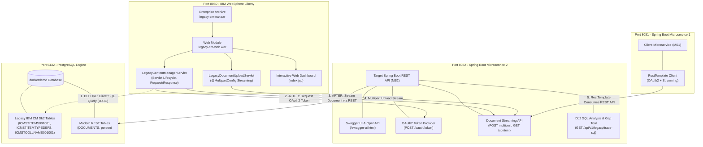

# Legacy Application Migration Demo: IBM Content Manager to Spring Boot REST APIs

This repository contains a production-style, beginner-friendly reference implementation demonstrating the end-to-end migration of legacy J2EE applications from **IBM Content Manager (Db2 direct SQL / SDK)** to modern **Spring Boot 3 REST APIs**.

---

## 📑 Table of Contents

1. [Executive Summary & Background](#1-executive-summary--background)
2. [What Were the Problems? (Before Migration)](#2-what-were-the-problems-before-migration)
3. [What Did the Migration Solve? (After Migration)](#3-what-did-the-migration-solve-after-migration)
4. [End-to-End Architecture & Component Deep-Dive](#4-end-to-end-architecture--component-deep-dive)
5. [Structured Migration Methodology: Discovery → Gap-Analysis → Migration](#5-structured-migration-methodology-discovery--gap-analysis--migration)
6. [Interactive Walkthrough Script](#6-interactive-walkthrough-script)
7. [How to Run the Entire System with Docker](#7-how-to-run-the-entire-system-with-docker)
8. [Comprehensive Endpoints Reference Table](#8-comprehensive-endpoints-reference-table)
9. [Automated Postman Collection Guide](#9-automated-postman-collection-guide)
10. [Interview Preparation Guide & Talking Points](#10-interview-preparation-guide--talking-points)

---

## 1. Executive Summary & Background

In large enterprise environments (banking, insurance, telecom, and government), document repositories have historically been managed by **IBM Content Manager (CM) v8**. Legacy enterprise applications ran as monolithic Enterprise Archives (**EAR**) containing Web Application Archives (**WAR**) on application servers such as **IBM WebSphere Application Server (WAS)**.

To access documents, legacy applications typically used one of two mechanisms:
1. **IBM Content Manager Java SDK**: Heavy C++ native wrappers (`DKDatastoreICM`, `DKDDO`, `DKLobICM`) via Java Native Interface (JNI).
2. **Direct Db2 SQL Queries**: To bypass the high overhead of the native SDK, legacy developers frequently executed raw SQL queries directly against internal Db2 catalog and collection tables (`ICMSTITEMS001001`, `ICMSTITEMTYPEDEFS`, and `ICMSTCOLLNAME001001`).

This project provides a functional demonstration of both the **legacy state** and the **migrated modern state**, allowing developers, architects, and interviewers to trace the migration step-by-step.

---

## 2. What Were the Problems? (Before Migration)

The legacy architecture exhibited several critical technical liabilities:

| Problem in Legacy Architecture | Root Cause | Impact on Enterprise Operations |
|---|---|---|
| **Tight Coupling to Internal Db2 Schema** | Servlets issued hardcoded SQL joins across `ICMSTITEMS001001` and `ICMSTCOLLNAME001001`. | Any vendor patch, database upgrade, or partition alteration broke the application without warning. |
| **Credential Sprawl & Zero API Security** | Servlets required direct database credentials (`dbUser`, `dbPassword`) configured in deployment descriptors. | Inability to enforce OAuth2 token-based authorization, rate limiting, or audit logging. |
| **JVM Heap Memory Exhaustion (OOM)** | Binary documents (BLOBs) were read into monolithic byte arrays in memory via `ResultSet.getBinaryStream()`. | Concurrent downloads of large PDF or TIFF files crashed the application server with `OutOfMemoryError`. |
| **Heavy Native SDK Overhead** | IBM CM SDK required architecture-dependent native C++ libraries (`libcm.so` / `cm.dll`) linked via JNI. | Blocked containerization (Docker), hindered cloud deployment, and caused difficult JVM crash dumps. |
| **Siloed Monolith** | J2EE EAR required bulky application servers (WebSphere) with long startup times and high licensing costs. | Incompatible with modern CI/CD pipelines, Kubernetes, or microservice ecosystems. |

---

## 3. What Did the Migration Solve? (After Migration)

By migrating the document ingestion and retrieval capabilities to a Spring Boot REST API:

| Modern Solution | Implementation in this Project | Benefit Delivered |
|---|---|---|
| **Decoupled REST Contract** | OpenAPI 3.0 / Swagger UI in [MS2/src/main/java/com/demo2/docker/config/OpenApiConfig.java](MS2/src/main/java/com/demo2/docker/config/OpenApiConfig.java) | Application code interacts exclusively with standard HTTP JSON and binary endpoints. |
| **OAuth2 Machine-to-Machine Security** | Client-Credentials flow (RFC 6749) in [MS2/src/main/java/com/demo2/docker/auth/OAuthController.java](MS2/src/main/java/com/demo2/docker/auth/OAuthController.java) | Direct database credentials eliminated. Automated Bearer token validation with scope enforcement. |
| **Chunked Binary Streaming** | `StreamingResponseBody` with 8KB buffers in [MS2/src/main/java/com/demo2/docker/document/DocumentController.java](MS2/src/main/java/com/demo2/docker/document/DocumentController.java) | Binary payloads stream directly through `InputStream`/`OutputStream`. Memory consumption remains constant (~8KB) regardless of file size. |
| **Multipart Ingestion** | `@PostMapping(consumes = MULTIPART_FORM_DATA)` in [MS2/src/main/java/com/demo2/docker/document/DocumentController.java](MS2/src/main/java/com/demo2/docker/document/DocumentController.java) | Standard HTTP multipart file upload supporting multi-megabyte documents seamlessly. |
| **Lightweight Containerization** | Multi-container Docker Compose in [docker-compose.yml](docker-compose.yml) | Fast startup, repeatable builds, and zero dependence on proprietary native C++ client libraries. |

---

## 4. End-to-End Architecture & Component Deep-Dive



### Detailed Component Inventory

#### 1. Legacy J2EE EAR Application (Port 8080)
* **Application Server**: **IBM WebSphere Liberty** running on Java 17 ([legacy-ear/Dockerfile](legacy-ear/Dockerfile), [legacy-ear/server.xml](legacy-ear/server.xml)).
* **Multi-Module Build**: Configured in [legacy-ear/pom.xml](legacy-ear/pom.xml). Maven compiles the WAR module ([legacy-ear/war/pom.xml](legacy-ear/war/pom.xml)), then packages it into the EAR module ([legacy-ear/ear/pom.xml](legacy-ear/ear/pom.xml)) with enterprise deployment descriptor [legacy-ear/ear/src/main/application/META-INF/application.xml](legacy-ear/ear/src/main/application/META-INF/application.xml).
* **Servlet Lifecycle Implementation**: In [legacy-ear/war/src/main/java/com/legacy/cm/LegacyContentManagerServlet.java](legacy-ear/war/src/main/java/com/legacy/cm/LegacyContentManagerServlet.java):
  * `init(ServletConfig)`: Loads database parameters and REST endpoint settings from [legacy-ear/war/src/main/webapp/WEB-INF/web.xml](legacy-ear/war/src/main/webapp/WEB-INF/web.xml) and environment variables. Initializes JDBC and REST clients.
  * `service()`: Intercepts and logs all incoming HTTP requests.
  * `doGet()`: Handles two operating modes:
    * `mode=sql`: Executes direct Db2 SQL query through [legacy-ear/war/src/main/java/com/legacy/cm/LegacyDirectDb2Dao.java](legacy-ear/war/src/main/java/com/legacy/cm/LegacyDirectDb2Dao.java).
    * `mode=rest`: Obtains OAuth2 Bearer token and consumes Spring Boot REST API through [legacy-ear/war/src/main/java/com/legacy/cm/ModernContentRestClient.java](legacy-ear/war/src/main/java/com/legacy/cm/ModernContentRestClient.java).
    * `mode=gap`: Returns architectural gap analysis matrix.
  * `destroy()`: Closes connections and releases pooled resources.
* **Multipart Upload Servlet**: [legacy-ear/war/src/main/java/com/legacy/cm/LegacyDocumentUploadServlet.java](legacy-ear/war/src/main/java/com/legacy/cm/LegacyDocumentUploadServlet.java) receives file uploads via `@MultipartConfig`, streams bytes from `Part.getInputStream()`, and forwards them to the Spring Boot REST API.
* **Interactive Web Dashboard**: [legacy-ear/war/src/main/webapp/index.jsp](legacy-ear/war/src/main/webapp/index.jsp) provides a UI for live demonstrations.

#### 2. Target REST API — Microservice 2 (Port 8082)
* **Framework**: Spring Boot 3.5.0 with Spring Data JPA and Springdoc OpenAPI ([MS2/build.gradle.kts](MS2/build.gradle.kts)).
* **OAuth2 Authentication**:
  * [MS2/src/main/java/com/demo2/docker/auth/OAuthController.java](MS2/src/main/java/com/demo2/docker/auth/OAuthController.java): Exposes `POST /oauth/token` implementing client-credentials flow (`client_id=legacy-app`, `client_secret=cm-secret-123`).
  * [MS2/src/main/java/com/demo2/docker/auth/TokenService.java](MS2/src/main/java/com/demo2/docker/auth/TokenService.java): Issues, validates, and manages token lifecycles.
  * [MS2/src/main/java/com/demo2/docker/auth/TokenSecurityFilter.java](MS2/src/main/java/com/demo2/docker/auth/TokenSecurityFilter.java): Enforces Bearer token presence on all protected `/api/v1/documents/**` endpoints.
* **Document Ingestion & Binary Streaming**:
  * [MS2/src/main/java/com/demo2/docker/document/DocumentController.java](MS2/src/main/java/com/demo2/docker/document/DocumentController.java):
    * `POST /api/v1/documents`: Ingests multipart files, reads `InputStream`, and stores metadata and binary data.
    * `GET /api/v1/documents/{id}/content`: Streams document binary payload chunk-by-chunk using `StreamingResponseBody`.
  * [MS2/src/main/java/com/demo2/docker/document/DocumentEntity.java](MS2/src/main/java/com/demo2/docker/document/DocumentEntity.java) & [MS2/src/main/java/com/demo2/docker/document/DocumentRepository.java](MS2/src/main/java/com/demo2/docker/document/DocumentRepository.java): JPA persistence layer.
* **Legacy SQL Discovery & Trace Endpoint**:
  * [MS2/src/main/java/com/demo2/docker/legacy/LegacyCmQueryController.java](MS2/src/main/java/com/demo2/docker/legacy/LegacyCmQueryController.java): Exposes `GET /api/v1/legacy/trace-sql` which executes the Db2 SQL join and displays real-time discovery and column-mapping output.
* **Interactive Swagger UI**: Configured in [MS2/src/main/java/com/demo2/docker/config/OpenApiConfig.java](MS2/src/main/java/com/demo2/docker/config/OpenApiConfig.java) with Bearer token authentication support.

#### 3. Client Microservice — Microservice 1 (Port 8081)
* **Framework**: Spring Boot 3.5.0 ([MS1/build.gradle.kts](MS1/build.gradle.kts)).
* **REST Consumer**: [MS1/src/main/java/com/demo/docker/Ms1Controller.java](MS1/src/main/java/com/demo/docker/Ms1Controller.java) uses Spring's `RestTemplate` (configured in [MS1/src/main/java/com/demo/docker/AppConfig.java](MS1/src/main/java/com/demo/docker/AppConfig.java)) to:
  * Obtain OAuth2 tokens from MS2.
  * Forward multipart uploads to MS2.
  * Stream binary documents from MS2 through MS1 directly to the caller using `StreamUtils.copy(InputStream, OutputStream)`.
  * Maintain existing `/ms1/persons` endpoints for backward compatibility.

#### 4. Database Layer (Port 5432)
* **Engine**: PostgreSQL container simulating IBM Db2 tables.
* **Initialization Script**: [postgres/init.sql](postgres/init.sql) seeds:
  * Legacy IBM Content Manager schema (`ICMSTITEMS001001`, `ICMSTITEMTYPEDEFS`, `ICMSTCOLLNAME001001`) with pre-loaded binary PDF and text documents.
  * Modern target REST schema (`DOCUMENTS`).
  * Existing original test table (`person`).

---

## 5. Structured Migration Methodology: Discovery → Gap-Analysis → Migration

The project follows the standard enterprise migration framework:

```
[ Phase 1: Discovery ]  ──►  [ Phase 2: Gap Analysis ]  ──►  [ Phase 3: Migration & Verification ]
  • Read legacy SQL joins      • Map Db2 tables to REST DTOs   • Implement Spring Boot REST APIs
  • Identify native SDK calls  • Define OAuth2 security model   • Refactor Servlets / RestTemplate
  • Profile document sizes     • Design chunked streaming       • Verify side-by-side parity
```

### Gap-Analysis Mapping Matrix

| Legacy Db2 / IBM CM Artifact | Target Spring Boot REST Equivalent | Migration Decision & Rationale |
|---|---|---|
| `itm.ITEMID` (VARCHAR 64) | `DocumentMetadataDto.itemId` | Preserved for backward-compatible document lookups across legacy systems. |
| `typ.ITEMTYPENAME` (VARCHAR 50) | `DocumentMetadataDto.itemType` | Converted from relational FK lookup table (`ICMSTITEMTYPEDEFS`) to an explicit metadata attribute. |
| `doc.FILENAME` (VARCHAR 255) | `DocumentMetadataDto.fileName` | Mapped to DTO and HTTP `Content-Disposition: attachment; filename="..."` header. |
| `doc.MIMETYPE` (VARCHAR 100) | `DocumentMetadataDto.mimeType` | Mapped to HTTP `Content-Type` header (e.g., `application/pdf`). |
| `doc.DOC_SIZE` (BIGINT) | `DocumentMetadataDto.fileSize` | Mapped to HTTP `Content-Length` header for accurate progress indicators. |
| `doc.DOCUMENT_DATA` (BLOB / BYTEA) | `GET /api/v1/documents/{id}/content` | **Critical change:** Replaced `ResultSet.getBinaryStream()` with HTTP chunked streaming (`StreamingResponseBody`). |
| Hardcoded DB credentials | `POST /oauth/token` | Machine-to-machine OAuth2 Client-Credentials grant (Bearer token). |
| Native `DKDatastoreICM` SDK | `HttpClient` / `RestTemplate` | Proprietary C++ JNI bridge eliminated in favor of standard HTTP protocol. |

---

## 6. Interactive Walkthrough Script

An interactive demonstration script is included: [demo-walkthrough.sh](demo-walkthrough.sh).

### Running the Script

1. Make sure the Docker containers are running (`docker compose up -d`).
2. Run the script in Git Bash, WSL, or Linux terminal:
   ```bash
   ./demo-walkthrough.sh
   ```
3. To run all steps automatically without pausing between them, pass the `--auto` flag:
   ```bash
   ./demo-walkthrough.sh --auto
   ```

### What the Script Demonstrates:

1. **Step 1: Architecture Health Check**: Verifies all 4 services are responding (PostgreSQL, MS2, MS1, WebSphere Liberty).
2. **Step 2: [BEFORE MIGRATION] Legacy Direct Db2 SQL**: Calls `GET http://localhost:8080/legacy-cm-web/legacy-cm?mode=sql&itemId=ICM_ITEM_001` and prints the raw SQL execution results.
3. **Step 3: [DISCOVERY & GAP ANALYSIS] Tracing Db2 Join**: Calls `GET http://localhost:8082/api/v1/legacy/trace-sql?itemId=ICM_ITEM_001` to display table-by-table schema decomposition.
4. **Step 4: [OAUTH2 SECURITY] Token Issuance & Protection**: Requests a Bearer token via `POST /oauth/token` and verifies that requests without tokens are rejected with `HTTP 401 Unauthorized`.
5. **Step 5: [MULTIPART STREAMING] Document Ingestion**: Uploads a test document via `multipart/form-data` with Bearer token authentication.
6. **Step 6: [AFTER MIGRATION] Servlet Consuming REST**: Calls `GET http://localhost:8080/legacy-cm-web/legacy-cm?mode=rest&docId=1` to prove the servlet now routes through the REST API.
7. **Step 7: [BINARY STREAMING] Chunked Content Download**: Streams a binary document chunk-by-chunk via HTTP `OutputStream`.
8. **Step 8: [MICROSERVICE CLIENT] MS1 RestTemplate**: Calls MS1 endpoints to demonstrate Spring Boot client consumption.

---

## 7. How to Run the Entire System with Docker

### Prerequisites
* Docker Desktop installed and running.
* 4 available ports: `5432`, `8080`, `8081`, `8082`.

### Start All Services
From the root workspace directory, run:
```bash
docker compose up --build
```

Docker Compose will build and launch:
1. `postgres-container` on port **5432** (database).
2. `ms2-container` on port **8082** (target REST API).
3. `ms1-container` on port **8081** (client microservice).
4. `legacy-ear-container` on port **8080** (IBM WebSphere Liberty running `legacy-cm-ear.ear`).

### Stop All Services
```bash
docker compose down
```

---

## 8. Comprehensive Endpoints Reference Table

### A. Target REST API — Microservice 2 (Port 8082)

| Method | Endpoint | Description | Auth Required? | Sample Request / Curl |
|---|---|---|---|---|
| `GET` | `/swagger-ui.html` | Interactive Swagger UI | None | Browser URL |
| `POST` | `/oauth/token` | Obtain OAuth2 Bearer Access Token | None (Credentials in form) | `curl -X POST http://localhost:8082/oauth/token -d "grant_type=client_credentials&client_id=legacy-app&client_secret=cm-secret-123"` |
| `POST` | `/api/v1/documents` | Ingest document via multipart upload | **Bearer Token** | `curl -X POST http://localhost:8082/api/v1/documents -H "Authorization: Bearer <token>" -F "file=@sample.pdf" -F "itemType=POLICY"` |
| `GET` | `/api/v1/documents/{id}/content` | Stream binary payload (chunked) | **Bearer Token** | `curl -H "Authorization: Bearer <token>" http://localhost:8082/api/v1/documents/1/content -o output.pdf` |
| `GET` | `/api/v1/documents/{id}` | Get document metadata (JSON) | **Bearer Token** | `curl -H "Authorization: Bearer <token>" http://localhost:8082/api/v1/documents/1` |
| `GET` | `/api/v1/documents` | List all document metadata records | **Bearer Token** | `curl -H "Authorization: Bearer <token>" http://localhost:8082/api/v1/documents` |
| `GET` | `/api/v1/legacy/trace-sql` | Trace legacy Db2 SQL & view gap analysis | None | `curl "http://localhost:8082/api/v1/legacy/trace-sql?itemId=ICM_ITEM_001"` |
| `GET` | `/ms2/persons` | Original person listing | None | `curl http://localhost:8082/ms2/persons` |
| `GET` | `/ms2/persons/{id}` | Original person lookup | None | `curl http://localhost:8082/ms2/persons/1` |

---

### B. Legacy J2EE EAR Application — WebSphere Liberty (Port 8080)
Context path: `/legacy-cm-web`

| Method | Endpoint | Query Parameters | Description |
|---|---|---|---|
| `GET` | `/legacy-cm-web/` | *none* | **Interactive Web Dashboard**: Browser UI for testing both Old and New flows |
| `GET` | `/legacy-cm-web/legacy-cm` | `mode=sql&itemId=ICM_ITEM_001` | **Before Migration**: Executes direct SQL against Db2 tables via JDBC PreparedStatement |
| `GET` | `/legacy-cm-web/legacy-cm` | `mode=sql&download=true&itemId=ICM_ITEM_001` | **Before Migration**: Downloads BLOB directly from database via `rs.getBinaryStream()` |
| `GET` | `/legacy-cm-web/legacy-cm` | `mode=rest&docId=1` | **After Migration**: Servlet acquires OAuth2 token and calls target Spring Boot REST API |
| `GET` | `/legacy-cm-web/legacy-cm` | `mode=rest&download=true&docId=1` | **After Migration**: Servlet streams binary content from REST API directly to client |
| `GET` | `/legacy-cm-web/legacy-cm` | `mode=gap` | Returns complete discovery & gap analysis JSON |
| `POST` | `/legacy-cm-web/legacy-upload` | *multipart form (file, itemType)* | Receives upload in servlet and forwards it as a multipart stream to MS2 REST API |

---

### C. Client Microservice — Microservice 1 (Port 8081)

| Method | Endpoint | Description |
|---|---|---|
| `GET` | `/swagger-ui.html` | Swagger UI for MS1 |
| `GET` | `/ms1/greet` | Health check endpoint |
| `GET` | `/ms1/persons` | Calls MS2 `/ms2/persons` via `RestTemplate` |
| `GET` | `/ms1/persons/{id}` | Calls MS2 `/ms2/persons/{id}` via `RestTemplate` |
| `GET` | `/ms1/token` | Obtains OAuth2 token from MS2 via `RestTemplate` |
| `POST` | `/ms1/documents/upload` | Multipart upload forwarded to MS2 via `RestTemplate` |
| `GET` | `/ms1/documents/{id}/stream` | Streams document from MS2 through MS1 directly to client `OutputStream` |

---

## 9. Automated Postman Collection Guide

The workspace includes a complete Postman collection: [postman_collection.json](postman_collection.json).

### Key Features of the Postman Collection:
* **Automated Token Management**: Request `1.1 Get OAuth2 Access Token` contains a Postman test script that parses `jsonData.access_token` and automatically saves it to the collection variable `{{access_token}}`.
* **Zero Manual Copy-Pasting**: All protected endpoints reference `{{access_token}}` automatically.
* **Auto-Captured Document IDs**: Request `2.1 Upload Document` parses the returned document ID and automatically sets `{{document_id}}` for subsequent streaming and metadata calls.

### How to Import and Use:
1. Open Postman.
2. Click **Import** → select [postman_collection.json](postman_collection.json).
3. Execute requests in order:
   * **`1.1 Get OAuth2 Access Token`** → Generates and saves token.
   * **`2.1 Upload Document (Multipart Stream)`** → Uploads file and auto-saves ID.
   * **`2.2 Stream Document Binary Content`** → Streams binary file.
   * **`3.1 Trace Legacy Db2 SQL Query Join`** → Traces legacy SQL join.
   * **`4.1 Legacy Direct Db2 SQL Mode`** → Tests WebSphere servlet before migration.
   * **`4.3 Migrated Modern REST Mode`** → Tests WebSphere servlet after migration.

---

## 10. Interview Preparation Guide & Talking Points

Use these concise, structured answers when discussing this project in an interview:

### Q1: "How do you approach migrating a legacy J2EE application from IBM Content Manager to REST APIs?"
> *"I follow a disciplined 3-phase methodology: **Discovery**, **Gap Analysis**, and **Migration & Parity Verification**.
> 1. In **Discovery**, we identify how the legacy application currently retrieves documents — whether via the IBM CM C++ native SDK (`DKDatastoreICM`) or via direct SQL queries against Db2 catalog tables (`ICMSTITEMS001001` and `ICMSTCOLLNAME001001`).
> 2. In **Gap Analysis**, we map the relational database columns to a decoupled REST domain model, replace database credentials with OAuth2 client-credentials security, and replace high-memory BLOB reads with chunked HTTP streaming.
> 3. In **Migration**, we implement the target Spring Boot REST APIs with OpenAPI documentation, refactor the legacy servlets or clients to consume the REST endpoints via standard HTTP clients, and verify side-by-side functional and binary parity."*

### Q2: "Why use OAuth2 Client Credentials rather than human login?"
> *"Because this is a **machine-to-machine (backend-to-backend)** migration. The legacy J2EE application running in WebSphere Liberty is an automated system calling the target Spring Boot REST service without human intervention. The OAuth2 Client-Credentials grant (RFC 6749) is the enterprise industry standard for service-to-service authentication, using provisioned `client_id`, `client_secret`, and authorized scopes."*

### Q3: "How do you handle large document binary streaming over REST without causing OutOfMemory errors?"
> *"Rather than loading the entire document byte array into the JVM heap memory, we stream the payload chunk-by-chunk. On the Spring Boot side, we use `StreamingResponseBody`, which writes directly to the HTTP response `OutputStream` in 8KB buffer chunks. On the client side, we use `InputStream` to read the chunks and write them directly to the destination `OutputStream` using `StreamUtils.copy()`. This ensures constant memory usage (~8KB) regardless of whether the document is 100KB or 500MB."*

### Q4: "What is the difference between WAR and EAR packaging in Maven?"
> *"A **WAR** (Web Application Archive) packages web-tier components: Servlets, JSP pages, static assets, and `WEB-INF/web.xml`. An **EAR** (Enterprise Archive) is an enterprise packaging standard that bundles one or more WAR modules, EJB modules, and shared third-party libraries into a single archive defined by `META-INF/application.xml`. In this project, [legacy-ear/pom.xml](legacy-ear/pom.xml) uses a Maven multi-module structure where the WAR module ([legacy-ear/war/pom.xml](legacy-ear/war/pom.xml)) is compiled first and then assembled into the EAR module ([legacy-ear/ear/pom.xml](legacy-ear/ear/pom.xml)) for deployment on IBM WebSphere Liberty."*

